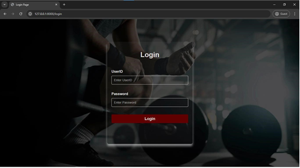
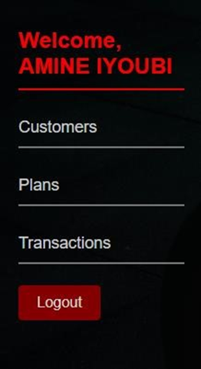
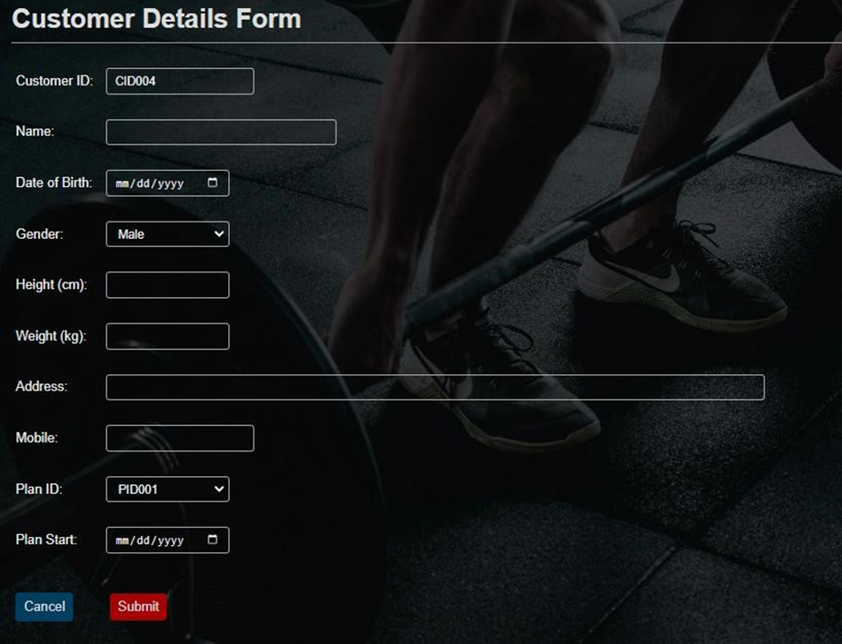
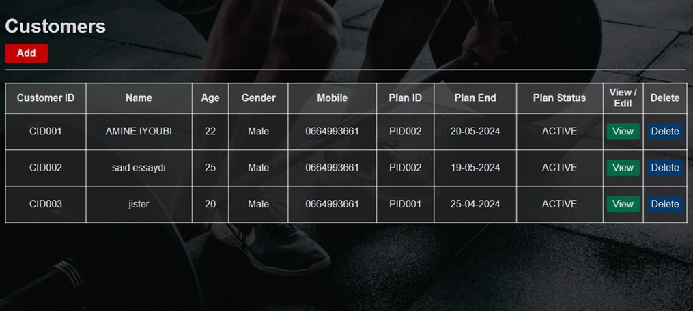
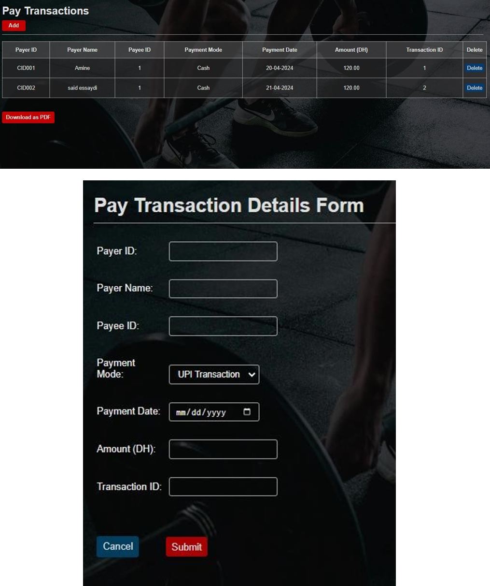

# ABTAL Sport Management System

A comprehensive web application for managing a sports facility, developed during an internship at ABTAL Sport Association. The system includes both administrative backend functionality and a public-facing frontend website.



## Features

### Backend (Admin Dashboard)
- Secure authentication system
- Client management system
- Subscription plans management
- Transaction tracking
- Administrative dashboard with analytics

#### Dashboard Navigation


#### Customer Management



#### Subscription Plans


### Frontend Website
- Modern, responsive design
- Hero section showcasing facility features
- About section
- Services overview
- Client testimonials
- Contact form

## Technologies Used

- **Backend:**
  - Laravel
  - MySQL

- **Frontend:**
  - Vite.js
  - HTML/CSS
  - Bootstrap

## Setup and Installation

1. Clone the repository
```bash
git clone [repository-url]
```

2. Install PHP dependencies
```bash
composer install
```

3. Install NPM packages
```bash
npm install
```

4. Configure environment variables
```bash
cp .env.example .env
php artisan key:generate
```

5. Set up the database
```bash
php artisan migrate
```

6. Start the development server
```bash
php artisan serve
npm run dev
```

## Project Structure

- `/resources` - Frontend assets and views
- `/app` - Backend logic and models
- `/database` - Database migrations and seeders
- `/routes` - Application routes
- `/public` - Publicly accessible files

## Contributors

- Developer: Amine IYOUBI
- Project Supervisors: 
  - Said Essaydi
  - Soufiane Ait Taleb

## Duration

This project was developed during an internship from April 1, 2024, to April 30, 2024, at ABTAL Sport Association.

## License

[MIT License](LICENSE)